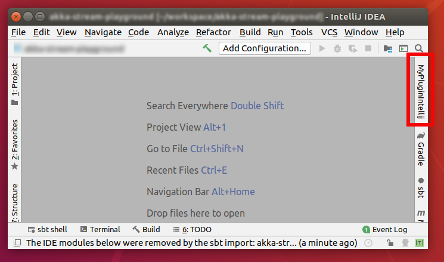
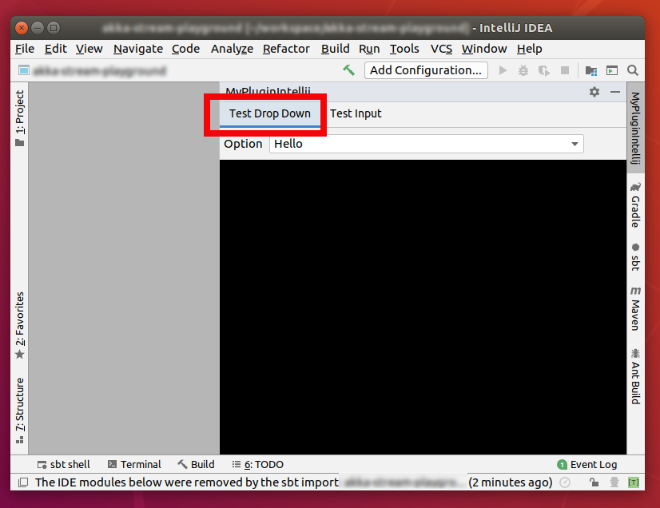
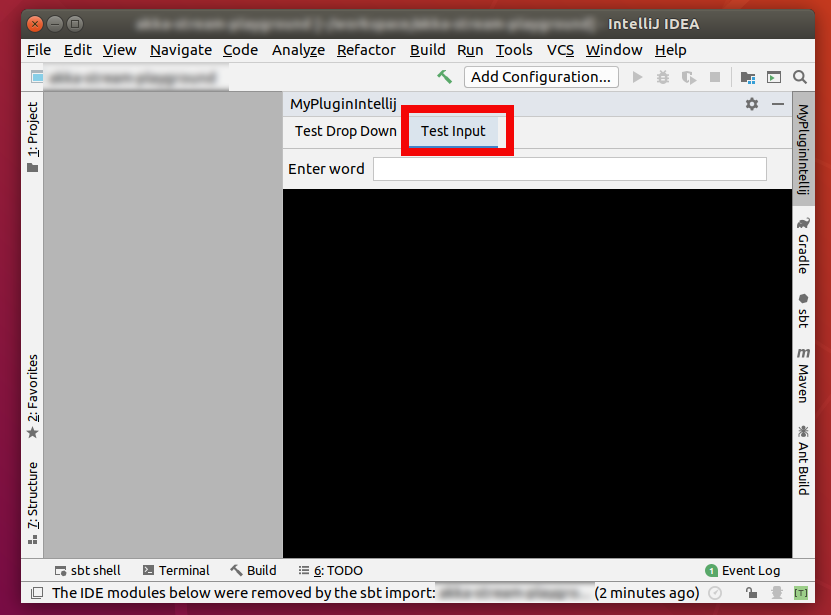

# myplugin-intellij - an example of a Intellij plugin

This project shows how to create a simple Intellij plugin which integrates a panel on the right hand-side.

This panel is composed of a set of tabs that can integrates different utilities.

It was written in scala

# Final result

You can see the plugin button on the right-hand side (defined in `src/main/resources/META-INF/plugin.xml`)

Clicking on it expands the panel where you can see the option tabs

 

# References

* https://github.com/zio/zio-intellij

* The apt-code youtube series

  * https://www.youtube.com/channel/UCtBO0qu4w_0VgKDPYvQsQhA

  * https://www.youtube.com/watch?v=fVos38m3CU4&t=3s
